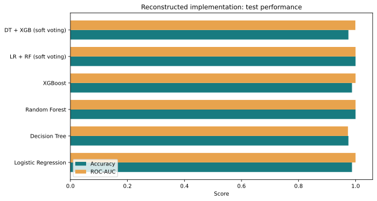
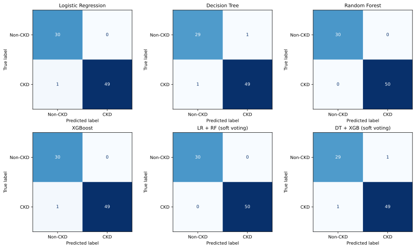
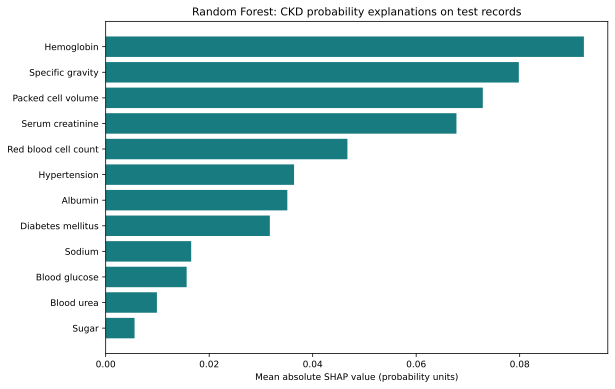

# Predicting Chronic Kidney Disease Risk Using Machine Learning Techniques

**Author:** [Tan Yann Bin](https://github.com/yannbintan)  
**Institution:** Sunway University  
**Project:** Capstone Project 2, Data Analytics

An academic machine learning project comparing four classifiers and two soft-voting ensembles for chronic kidney disease (CKD) classification. It includes data cleaning, exploratory analysis, evaluation, and explanations using coefficients, feature importance, and SHAP.

**This repository contains a runnable reconstruction of the documented capstone.** The original final notebook was unavailable when the repository was prepared. The code uses training-only preprocessing and records its own results. The [original reported results](docs/reported_results.md) are preserved separately.



## What is included

| File or folder | Purpose |
|---|---|
| [ckd_pipeline.py](ckd_pipeline.py) | Complete workflow: cleaning, training, evaluation, charts, and SHAP |
| [CKD_Capstone.ipynb](CKD_Capstone.ipynb) | Guided notebook that runs the same workflow |
| [data/](data/) | Supplied dataset, source attribution, and file checksum |
| [requirements.txt](requirements.txt) | Package versions used for the verified Python run |
| [results/](results/) | Recorded metrics, test predictions, explanations, and figures |
| [tests/test_pipeline.py](tests/test_pipeline.py) | Checks for training-only preprocessing, soft voting, and data validation |

## Run the project

Use **Python 3.12**. The command-line workflow needs no notebook server or GPU.

```bash
git clone https://github.com/yannbintan/CKD-Capstone-Project.git
cd CKD-Capstone-Project
```

**Windows (PowerShell or Command Prompt):**

```powershell
py -3.12 -m venv .venv
.venv\Scripts\python -m pip install -r requirements.txt
.venv\Scripts\python ckd_pipeline.py
```

**macOS / Linux:**

```bash
python3.12 -m venv .venv
.venv/bin/python -m pip install -r requirements.txt
.venv/bin/python ckd_pipeline.py
```

The run creates an `outputs/` directory containing metrics, predictions, figures, SHAP values, and `run_metadata.json`. That metadata file is written only after the entire requested run succeeds. It records dataset and source checksums, package versions, model settings, and the exact train/test row indices.

For another run, choose a new directory with `--output outputs-second-run`. Existing nonempty output directories are protected against overwriting. Other options are `--data PATH`, `--seed 42`, `--test-size 0.2`, and `--skip-shap`. Changing the split or packages may change the results.

To use the notebook, install `requirements-notebook.txt` instead of `requirements.txt`, launch `.venv\Scripts\jupyter lab` on Windows or `.venv/bin/jupyter lab` on macOS/Linux, and open `CKD_Capstone.ipynb`. The notebook creates a fresh folder inside `outputs/` for each run.

The [XGBoost installation guide](https://xgboost.readthedocs.io/en/stable/install.html) covers platform prerequisites if installation reports a missing native library. Execution was verified on Linux with Python 3.12; Windows and macOS were not tested here.

## Dataset and preparation

The supplied CSV contains **400 records, 24 predictors, one ID, and one target**. After whitespace cleanup, there are **250 CKD** and **150 non-CKD** records. The positive class is **CKD = 1**; non-CKD = 0. Both `id` and `classification` are excluded from the predictor matrix.

The data originates from the [UCI Chronic Kidney Disease dataset](https://archive.ics.uci.edu/dataset/336/chronic+kidney+disease), credited to Rubini, Soundarapandian, and Eswaran. The supplied CSV was verified against UCI's data after normalizing formatting and column names. See [data/README.md](data/README.md) for attribution, the CC BY 4.0 license link, the checksum, and modelling choices.

The workflow:

1. Cleans whitespace, missing markers, numeric values, and target labels.
2. Makes a stratified 80/20 split using `random_state=42`.
3. Fits numeric median and categorical mode imputers **only on training records**.
4. Encodes ten categorical predictors using documented binary mappings.
5. Fits a StandardScaler for Logistic Regression only, including its ensemble component.
6. Trains all six model configurations and evaluates the same held-out records.

Each learner has its own scikit-learn pipeline, including learners inside the soft-voting ensembles. EDA of predictor distributions and correlations uses the training set. No hyperparameter search or test-based tuning is performed.

## Results from this implementation

These results were generated by the code in this repository on **80 test records: 50 CKD and 30 non-CKD**. They are not substituted for the submitted report's results.

| Model | Accuracy | Precision | Recall | F1-score | ROC-AUC |
|---|---:|---:|---:|---:|---:|
| Logistic Regression | 0.9875 | 1.0000 | 0.9800 | 0.9899 | 1.0000 |
| Decision Tree | 0.9750 | 0.9800 | 0.9800 | 0.9800 | 0.9733 |
| Random Forest | 1.0000 | 1.0000 | 1.0000 | 1.0000 | 1.0000 |
| XGBoost | 0.9875 | 1.0000 | 0.9800 | 0.9899 | 1.0000 |
| LR + RF, soft voting | 1.0000 | 1.0000 | 1.0000 | 1.0000 | 1.0000 |
| DT + XGB, soft voting | 0.9750 | 0.9800 | 0.9800 | 0.9800 | 0.9993 |

Random Forest and LR + RF tied at 80/80 correct in this run. Logistic Regression and XGBoost each classified 79/80 correctly; Decision Tree and DT + XGB each classified 78/80 correctly. The ensembles average their components' predicted probabilities with equal weights.

Full values are in [metrics.csv](results/metrics.csv). Individual predictions, probabilities, and actual labels are in [test_predictions.csv](results/test_predictions.csv). The [run metadata](results/run_metadata.json) identifies the exact computation.



## Interpretability

The workflow produces standardized Logistic Regression coefficients, the three standalone tree models' feature importance, and Random Forest SHAP explanations for the CKD probability. SHAP uses the training path counts stored in the forest as its background distribution and explains the test records. The run checks that the SHAP contributions plus their baseline reproduce the model's CKD probabilities.



Coefficients and SHAP values describe model associations, not causal effects. Feature rankings can depend on correlated predictors and the selected split. See [results/figures/](results/figures/) for EDA, correlations, ROC curves, coefficient/importance plots, and SHAP importance.

## My contribution

My capstone work covered problem definition, dataset preparation, exploratory analysis, the six model configurations, performance comparison, interpretation, and the final report and presentation. This repository packages the documented study into an executable workflow with updated preprocessing, run instructions, and separately recorded verification results.

## Validation and limitations

Run the regression checks with the environment's Python:

```bash
python -m unittest discover -s tests -v
```

Replace `python` with `.venv\Scripts\python` on Windows or `.venv/bin/python` on macOS/Linux if the environment is not activated. Six checks cover dataset integrity and splitting, fitted preprocessing statistics, ensemble probabilities, whitespace cleanup, invalid labels, and completely missing training features.

The full Python workflow was executed, including SHAP. The notebook's four code cells were also executed sequentially using IPython and its file format was validated. An interactive Jupyter server was not launched here. Recorded results are from a small dataset and a single test split. They do not establish generalisation to new hospitals or populations. The target represents existing CKD status; this experiment does not validate future disease-onset prediction. This is an academic project and has not been validated for clinical use.

Details of the reconstruction and differences from the report appear in [docs/reported_results.md](docs/reported_results.md).
